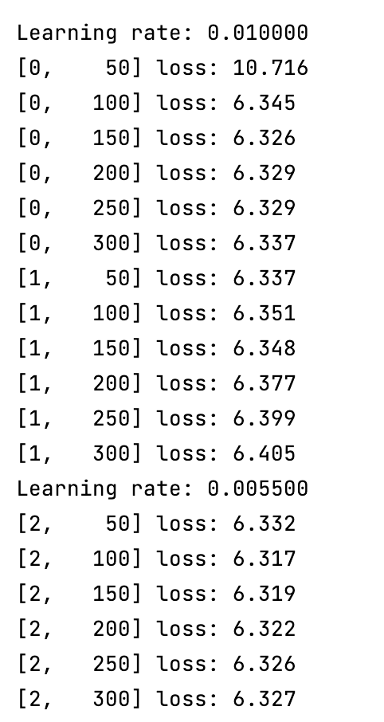
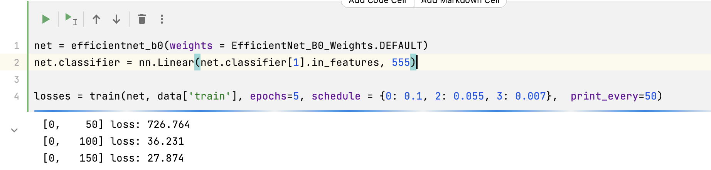
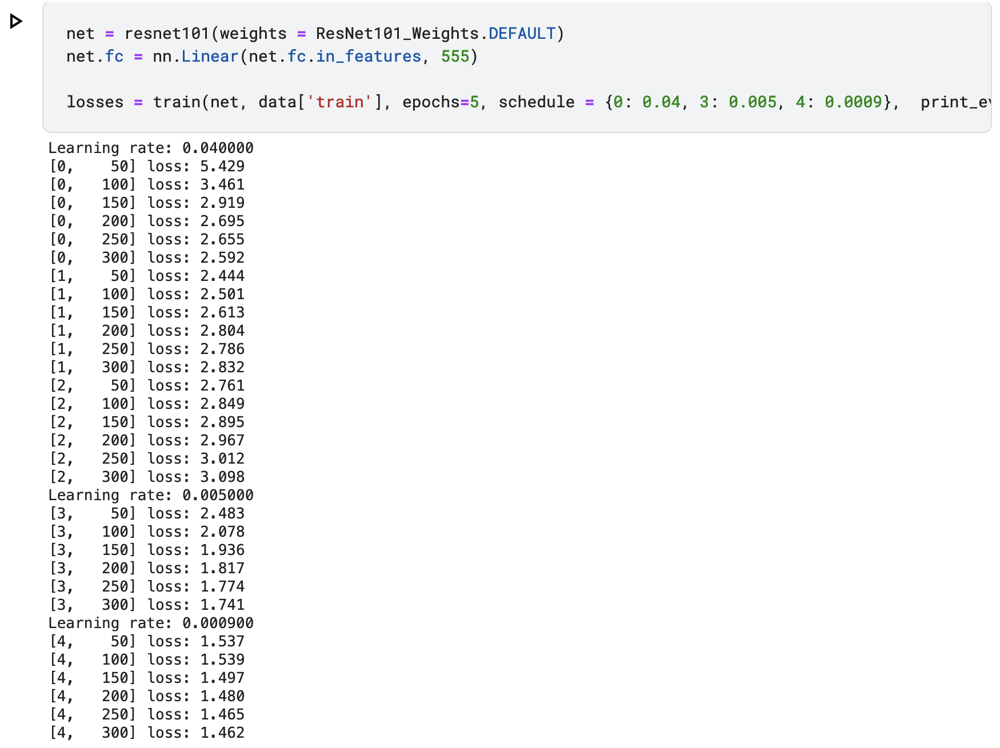
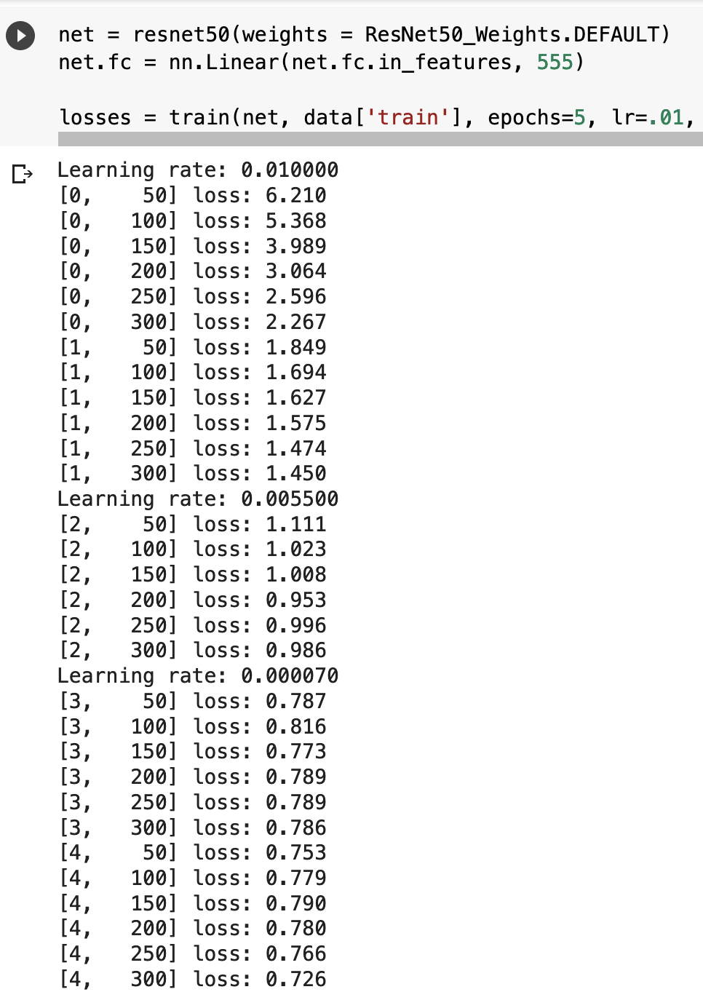

# Bird Image Classifier: Finding an Economic Solution  

For the final project of CSE 455, I decided to do the kaggle bird classification. 

### Project Scope and motivation

For the kaggle competition, I was limited by the processing power 
available for training. Due to this, I decided to  explore all the 
less intensive models available on the `torchvision` library. To make 
the most economical use of the computing resources available to me, I decided to explore,  
train and run the less intensive (pre-trained) models. The models which I tested are as follows: 

- Mobilenet with weights MobileNet_V3_Large_Weights.IMAGENET1K_V2
- Efficientnet with weights EfficientNet_B3_Weights.IMAGENET1K_V1
- Resnet101 with weights ResNeXt101_64X4D_Weights.IMAGENET1K_V1
- Resnet50 with weights ResNet50_Weights.IMAGENET1K_V2

Resnet101 model is intuitively not less intensive to train. However, I decided to use it  
as a comparison factor, and also because resnet 50 is the default model we used in the class. 

Video: https://www.youtube.com/watch?v=_-yyJsA3NYM

### Method

For each model, I divided the training process of every model in 4 steps: 

##### Step 1 
Create the model and train it for 4 to 5 epochs to see the convergence with different 
learning rates. Terminate if significant convergence does not occur by the third epoch. 
Add the schedule of higher learning rate for the first one to two epochs and lower it for fine tuning. 

##### Step 2
Once a satisfactory convergence is observed in step 1, train the model for 2 more epochs, this time
to look for a good learning rate to find a good minima. There is a chance of the optimizer getting 
stuck in the local minima. To mitigate that, add some momentum to explore more regions. 

#### Step 3
Continue training the model for sets of 2 epochs with varying learning rate and optimizer
until a good minima is reached. 

#### Step4 
Use the model to generate predictions and evaluate on kaggle

Normally, the training approach would involve options like k-cross validation. But owing to the limited 
compute resources for the task, my focus was to find the model which could be fast and reliably trained.
The assumption being that in a time constrained situation, validation is generally a secondary option as long as a good amount of 
regularization is applied. 

I trained the models both on CPU and google colab GPUs. I preferred light models like mobilenet 
and efficientnet over CPU, and heavier models of ResNet on a GPU.

_______

### Observations: 

#### Mobilenet with weights MobileNet_V3_Large_Weights.IMAGENET1K_V2

Mobilenet appeared to be a promising option owing to its light nature. However, it was still intensive enough to train
and took a considerable time (~15 minutes per epoch) to make any significant progress. Regardless of learning rate and optimizer 
changes (including SGD, Adam, NAdam and RMSProp). However, it did not converge much for the first 4 epochs. 
It was keeping the loss values consistently around 6.0 and 7.0. Thus, Mobilenet did poorly for step 1. 

In conclusion, mobilenet might not be an ideal option for a fast training classifier on image based datasets

#### Efficientnet with weights EfficientNet_B3_Weights.IMAGENET1K_V1

Efficientnet seemed like the next best option. However, it had an issue of high loss in the beginning. This took a 
long time to converge. It did converge in the end after considerable training and I trained it to ~70% accuracy with a colab GPU over 10 epochs. However, 
it is not an economical or fast solution. 

My belief is that the efficientnet needs to have a specific learning rate, or the variance 
of the model is very high for minor changes in learning rate. 

#### Resnet101 with weights ResNeXt101_64X4D_Weights.IMAGENET1K_V1

I decided to next check the slightly heavyweight model of ResNet101. Assuming that I could use 
kaggle GPUs to train it for a longer period than colab, I started training it with Kaggle's 
P 100 GPU. However, it was still a slow process, and did not converge as fast as expected across the 
range of learning rates I tried. 

This points to the idea that Resnet101 is slow to converge, but it converges steadily with time. 

#### Resnet50 with weights ResNet50_Weights.IMAGENET1K_V2

Next step of Resnet50 was a middle ground between Efficientnet and Resnet101. It was a bit faster to train 
as compared to the Resnet101. I trained it on colab GPUs, but couldn't train it continuously for 10 full epochs as 
the colab timed out by the 5th epoch. However, the 4+2 epoch step seemed to be doing fine with a need to switch to CPU 
midway in the process. 

As seen above, Resnet50 seemed to be converging a lot faster than Resnet101, as it was a bit easier to locate a
good learning rate. I was able to get ~73% accuracy with it within 6 epochs. Considering the rate of convergence, 
the accuracy should rise to anywhere between 75-78% in 10 epochs. 

### Conclusion

From the above results, Resnet50 seems to be the middle ground solution that seems to work for creating a quick classifier reliably. 
Efficientnet is a good classifier, but it is hard to tune with hyperparameters. Mobilenet is somewhat light, but difficult to tune and unreliable. 
Resnet_101 is reliable, but a slower and costiler model to train. 

Results have been submitted to kaggle

